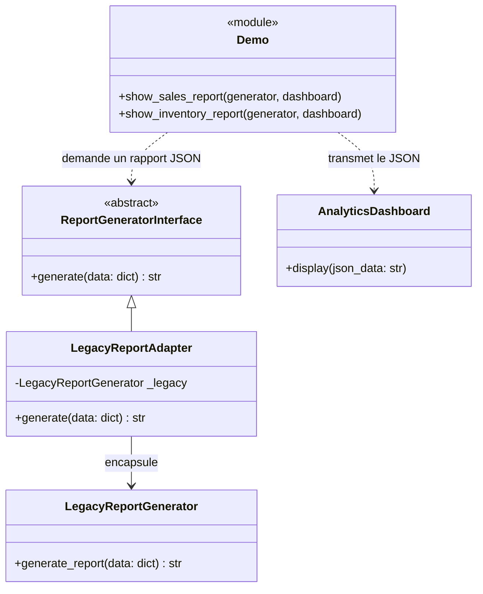

# Adapter Pattern — Reporting System

```mermaid
classDiagram
    class ReportGeneratorInterface {
        <<abstract>>
        +generate(data: dict) str
    }
    class LegacyReportAdapter {
        -LegacyReportGenerator _legacy
        +generate(data: dict) str
    }
    class LegacyReportGenerator {
        +generate_report(data: dict) str
    }
    class AnalyticsDashboard {
        +display(json_data: str)
    }
    class Demo {
        <<module>>
        +show_sales_report(generator, dashboard)
        +show_inventory_report(generator, dashboard)
    }

    ReportGeneratorInterface <|-- LegacyReportAdapter
    LegacyReportAdapter --> LegacyReportGenerator : encapsule
    Demo ..> ReportGeneratorInterface : demande un rapport JSON
    Demo ..> AnalyticsDashboard : transmet le JSON
```

Le générateur historique produit du XML. L’adaptateur lit ce XML et génère le JSON attendu par le tableau de bord.
